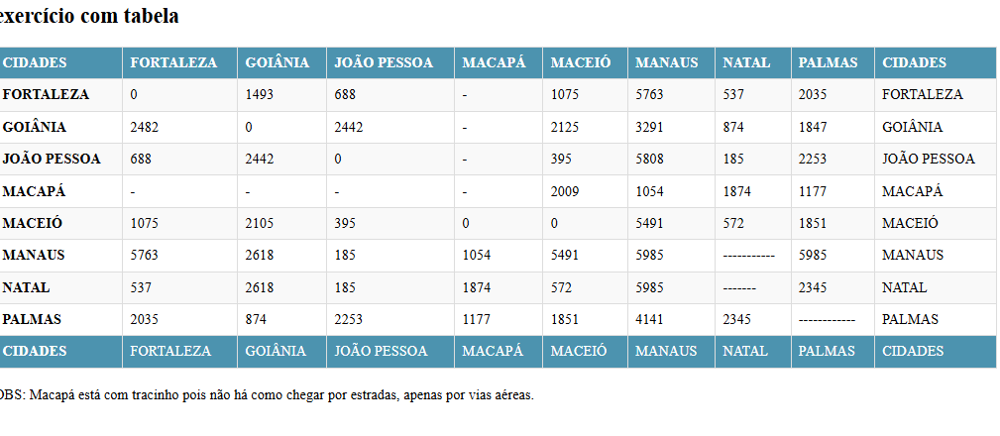

# Projeto - Distância entre capitais brasileiras

Projeto criado como parte avaliativa da disciplina de Fundamentos de desenvolvimento ministrada pelo professor Leonardo Rocha.
## Ìndice

* [Descrição](#descrição)
* [Tecnologias](#tecnologia)
* [Referencia](#referência)
* [Autor(a)](#autora)

### Descrição
O projeto consiste na composição de uma tabela que conta com capitais brasileiras e a distancia entre essas 
capitais. As capitais constantes nesse projeto são:

* FORTALEZA
* GOIÂNIA
* JOÃO PESSOA
* MACAPÁ
* MACEIÓ
* MANAUS
* NATAL
* PALMAS
### Resultado do projeto

#### Tabela
* table- O elemento <table> HTML representa dados tabulares — isto é, informações apresentadas em uma tabela bidimensional composta por linhas e colunas de células contendo dados .

* tr-A etiqueta <tr> que significa table row é usada para definir uma linha.

* td-A etiqueta <td> que significa table data é usada para definir uma célula.

#### Estilo

## Tecnologia
* HTML5
* CSS3
* README
* GIT
* GITHUB

## Referência
[Alura](https://www.alura.com.br/artigos/escrever-bom-readme)-
Como escrever um README incrível no seu Github.

## Autor(a)
O projeto foi desenvolvido pelo grupo:

* Sabrina Cardoso;
* Ana Laura Matos;
* Willian Baracho;
* João Pedro Berto;
* Flora Natalia;
* Brenda Gomes;

